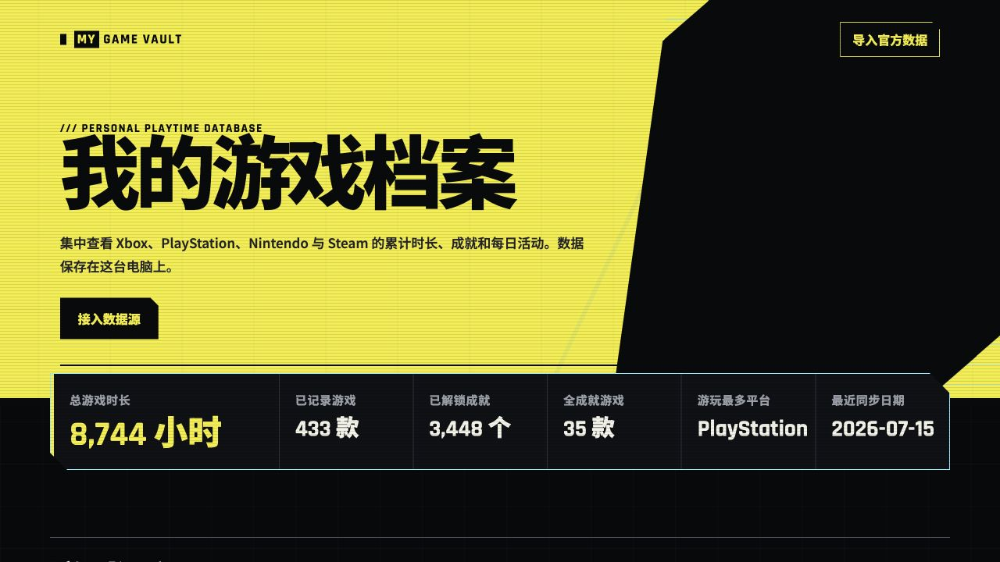
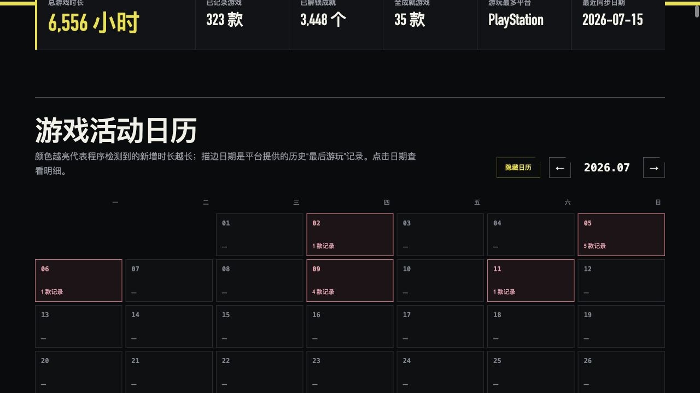
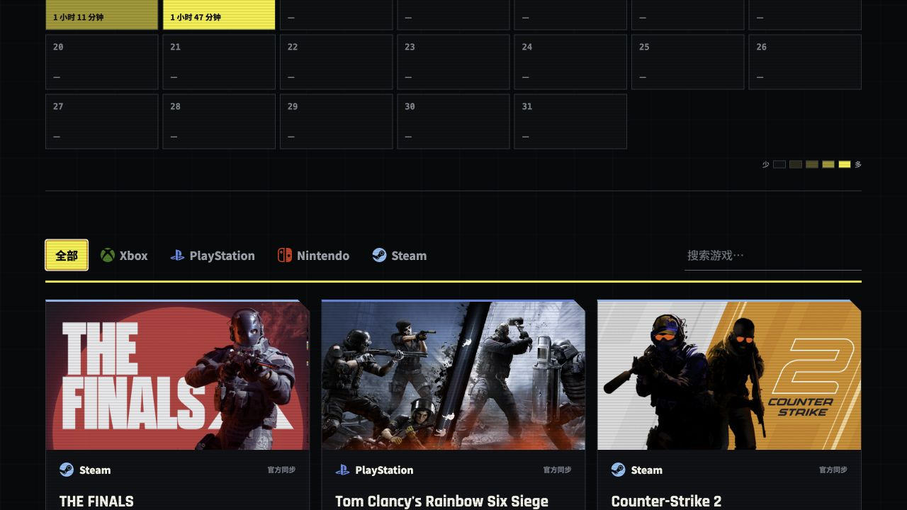

# My Game Vault

> 搭建属于自己的全平台游戏记录网站。


My Game Vault 是一个本地优先的 Xbox、PlayStation、Nintendo 与 Steam 游戏档案。它把不同平台的累计时长、成就、海报、最后游玩日期和 MC 评分归一到同一个赛博朋克风格页面，同时明确区分“官方确切数据”和“无法从接口还原的数据”。

## 界面预览







## 为什么值得一试

- **一站式游戏履历**：统一展示四个平台，自动过滤 0 分钟记录并汇总总时长、游戏数、成就和全成就游戏。
- **不是普通列表**：横版海报、官方平台图标，以及从《赛博朋克 2077》官网提炼的高对比黄色、切角面板、窄体技术字和间歇式信号故障；点击海报可进入对应官方商店。
- **可解释的游戏日历**：根据两次同步间的累计时长差生成每日分钟数；只有最后游玩日期、没有分钟数时会明确标为“当日时长未知”，不会伪造历史。
- **近两周时长脉冲**：连续展示最近 14 天的分平台堆叠时长，确切记录与同步检测值使用同一套日历口径，并用“≈”标出包含累计差值的日期。
- **自己的精彩时刻频道**：把截图和录屏放进本地媒体目录，网站会自动生成只读画廊；可将原始视频同步到S3兼容对象存储，让朋友播放原画时不再占用家庭隧道带宽。
- **轻量的留言与点赞**：朋友可以在首屏输入一句短留言并按回车发送，文字会沿顶部窄轨循环飘过；独立的爱心按钮允许重复点击并持续累计。
- **评分多级补全**：依次核对 RAWG、RAWG 游戏详情、Steam 商店官方 Metacritic 元数据与 Metacritic 公开游戏页；内置 Nintendo 日文/中文标题和 Switch 2 Edition 的规范名匹配，结果缓存 30 天。
- **本地隐私设计**：SQLite 数据和平台凭据只保存在本机；凭据采用 AES-256-GCM 加密，账号密码和验证码不会写入数据库。
- **数据源可替换**：每个平台连接器独立，最终统一为同一种游戏数据模型，便于后续适配平台接口变化。

## 快速开始

需要 Node.js 22.5 或更高版本。

```bash
git clone https://github.com/Gamer1ce/my-game-vault.git
cd my-game-vault
npm install
npm start
```

打开 <http://localhost:4173>。首次启动会自动创建 `data/games.db` 和本机凭据文件。

### macOS 一键启动

双击项目根目录中的 `启动游戏时光库.command` 即可。它会在首次运行时安装依赖、启动服务并自动打开浏览器；终端窗口保持打开时，网站会继续运行和自动同步。

如果 macOS 阻止首次打开，请右键该文件选择“打开”，确认一次后即可正常双击。也可以把它拖到桌面或 Dock 旁边方便使用。

运行测试：

```bash
npm test
```

### 自定义主屏幕图标

项目已配置 Web App Manifest、浏览器 favicon 和 iPhone/iPad 的 Apple Touch Icon。当前图标由项目所有者提供的 Xbox Design Lab 风格图片居中裁切而成，保留了中央粉色手柄与闪电、宝箱、草莓等元素；图标本身没有预先裁成圆角，系统会按设备样式自动生成圆角遮罩。

需要换成自己的图片时，准备一张至少 `512 × 512` 的正方形 PNG，并替换下列当前启用的版本化文件：

- `public/icons/app-icon-512-v2.png`：Android/PWA 与高清显示
- `public/icons/app-icon-192-v2.png`：Android/PWA 小图标
- `public/icons/apple-touch-icon-v2.png`：iPhone/iPad，尺寸 `180 × 180`
- `public/icons/favicon-32-v2.png`：浏览器标签页，尺寸 `32 × 32`

也可以在 macOS 使用 `sips` 从一张正方形原图生成各尺寸：

```bash
cp my-square-icon.png public/icons/app-icon-512-v2.png
sips --resampleHeightWidth 512 512 public/icons/app-icon-512-v2.png
cp public/icons/app-icon-512-v2.png public/icons/app-icon-192-v2.png
cp public/icons/app-icon-512-v2.png public/icons/apple-touch-icon-v2.png
cp public/icons/app-icon-512-v2.png public/icons/favicon-32-v2.png
sips --resampleHeightWidth 192 192 public/icons/app-icon-192-v2.png
sips --resampleHeightWidth 180 180 public/icons/apple-touch-icon-v2.png
sips --resampleHeightWidth 32 32 public/icons/favicon-32-v2.png
```

iOS 会按图标 URL 长期缓存已添加到主屏幕的旧图标，单纯覆盖同名文件通常不会更新。更换图片时应使用新的文件名并同步修改 `public/index.html` 和 `public/site.webmanifest`；部署后删除原来的主屏幕快捷方式，再从 Safari 的“分享”→“添加到主屏幕”重新添加。当前示例图像仅用于项目所有者的个人网站；公开分发或制作派生项目时，请替换为你拥有使用权的图像。

### 自定义游戏好友入口

首屏“查看平台档案”旁提供 Xbox、PlayStation、Nintendo 和 Steam 好友入口。Xbox 与 Steam 可以打开公开个人主页；PlayStation 在线 ID 会在点击后复制，适合粘贴到主机或 PlayStation App 搜索；Nintendo 没有通用网页好友链接，需要填写 Switch 上显示的 `SW-xxxx-xxxx-xxxx` 好友代码。

制作自己的版本时，在 `public/index.html` 的 `friend-links` 区域替换公开昵称、好友代码和个人主页地址，并同时修改 `aria-label`。这些内容会直接展示给所有访客，只能填写愿意公开的游戏昵称或好友代码；不要把邮箱、XUID、API Key、NPSSO 或 Nintendo 授权链接放在这里。

### 留言弹幕与站点点赞

首页顶部只放置一条窄留言输入框和一个独立的爱心按钮，不增加大面积面板。留言最多 72 个字符，按回车发送；最新 36 条会在桌面端沿两条透明窄轨循环播放，小屏幕收为一条，系统开启“减少动态效果”时改为可横向滚动的静态文字。服务器最多保留最近 500 条留言。

点赞没有每人一次或累计数量上限，每次点击都会写入 SQLite。为了防止脚本瞬间拖垮自用服务器，留言和点赞接口仍有短时请求频率保护；这只限制异常点击速度，不限制最终点赞总数。

留言与点赞和游戏记录一起保存在 `data/games.db`。公开写入只开放 `/api/guestbook` 与 `/api/likes`，两者都会检查同源请求、限制正文长度并以纯文本显示；平台授权、导入和同步接口仍需要管理员权限。迁移网站时复制数据库即可同时带走留言和点赞。

### 添加游戏精彩时刻与截图

首次启动后，项目会自动创建默认目录：

```text
data/highlights/
```

把希望公开展示的文件直接放进这个文件夹，再刷新网站即可。页面按文件修改时间从新到旧排列；文件名会作为标题显示，例如 `赛博朋克2077_荒坂塔.mp4` 会显示为“赛博朋克2077 荒坂塔”。目前支持：

- 图片：JPG、JPEG、PNG、WebP、GIF、AVIF
- 视频：MP4、WebM、MOV、M4V

为了让 iPhone、Android 和桌面浏览器都更容易播放，视频推荐使用 **MP4 + H.264 视频 + AAC 音频**。MOV 是否能播放取决于访客设备的浏览器解码能力。

网站通过只读接口 `GET /api/highlights` 返回媒体清单，通过 `/media/highlights/文件名` 提供图片和支持断点播放的视频。它没有网页上传、覆盖或删除接口；访客只能查看。要移除内容，直接在本机删除对应文件并刷新页面。

`data/highlights/` 已加入 `.gitignore`，媒体不会随源码上传 GitHub。但开启公网分享后，放入其中的每个文件都会对拿到网站地址的人可见；请先移除不希望公开的截图、文件名和照片定位等元数据。视频也会占用运行网站这台电脑的上行带宽，建议先压缩体积。

#### 把媒体库放在外置硬盘

macOS 用户可以双击项目根目录的 `设置精彩时刻文件夹.command`，选择外置硬盘上的任意文件夹。程序只保存该文件夹的路径，图片和视频仍留在外置硬盘，不会复制到电脑或 GitHub。配置文件是本机私有的 `data/highlights-path.txt`，已经被 Git 忽略。

- 设置完成后直接刷新页面即可，不需要重启网站。
- 外置硬盘未连接时，网站和游戏数据仍正常工作，“精彩时刻”会显示“外置媒体库未连接”；重新连接硬盘并刷新即可恢复。
- macOS 通常把外置卷挂载到 `/Volumes/硬盘名称`。请保持硬盘名称不变，并在播放结束后再弹出硬盘。
- 双击同一个设置工具并选择“使用项目默认文件夹”，可以随时恢复 `data/highlights/`。

服务器部署或 Linux 用户也可以设置绝对路径环境变量，环境变量的优先级高于本机配置文件：

```bash
HIGHLIGHTS_DIR='/Volumes/GameDisk/My Game Captures' npm start
```

#### 原画视频走云端，网页与游戏数据仍走本机

当本机隧道带宽低于原视频码率时，可以启用混合媒体架构：外置硬盘继续保存原文件，网站、游戏数据和截图仍由本机提供；原始视频额外同步到S3兼容对象存储。访客点击视频时，服务器才生成短期有效的云端播放地址，视频流量不会经过本机隧道，也不会重新编码或降低画质。

这项功能兼容AWS S3以及提供S3兼容API的对象存储。AWS SDK的分段上传会处理数GB的大文件；私有存储桶播放使用预签名 `GetObject` 地址。参考：[AWS SDK分段上传](https://docs.aws.amazon.com/AWSJavaScriptSDK/v3/latest/Package/-aws-sdk-lib-storage/)与[预签名URL](https://docs.aws.amazon.com/AWSJavaScriptSDK/v3/latest/Package/-aws-sdk-s3-request-presigner/)。

macOS设置步骤：

1. 在对象存储服务中创建一个私有Bucket，取得Region、S3 API地址、Access Key和Secret Key；密钥仅授予该Bucket的对象读取、写入和查询权限。
2. 双击 `配置云端视频.command`，填写自动创建的 `data/remote-media.env` 并保存。
3. 双击 `同步云端视频.command`。第一次会上传全部原视频，之后大小相同的对象会自动跳过；数GB文件会使用分段上传。
4. 退出并重新双击 `启动游戏时光库.command`。已经上传的视频卡片会显示“云端原画”，点击后从云端直接播放。

也可以在终端执行：

```bash
set -a
source data/remote-media.env
set +a
npm run media:sync
npm start
```

配置说明：

- `MEDIA_S3_PUBLIC_BASE_URL` 默认留空，此时Bucket可以保持私有，网站会生成默认30分钟有效的播放链接。
- 只有已经为Bucket配置公开CDN域名时才填写公开地址；公开地址没有链接有效期保护。
- 实际配置、上传清单、数据库和媒体文件都位于Git忽略范围，GitHub只包含不带密钥的模板。
- 云端没有对应对象或签名失败时，播放器会自动回退到外置硬盘的本地地址；此时仍受隧道带宽限制。
- 上传不会压缩或修改原始视频。第一次上传可能耗时很长，但这是一次性上行；完成后朋友的每次播放都由远程存储承担。

## 连接游戏平台

连接成功后会立即同步一次。服务启动后也会自动检查已连接的平台，持续运行时每小时再次同步。管理员还可使用页面底部的“立即同步游戏数据”一次更新全部已连接平台，或在“数据来源”中单独同步某个平台。手动同步和定时同步重叠时只会执行同一轮任务，避免重复请求平台接口。

### PlayStation

1. 在浏览器登录 [PlayStation 官网](https://www.playstation.com/)。
2. 保持登录并打开 [Sony NPSSO 页面](https://ca.account.sony.com/api/v1/ssocookie)。
3. 复制 JSON 中的 `npsso` 值，粘贴到本程序。

程序使用 [`psn-api`](https://github.com/achievements-app/psn-api) 将 NPSSO 换成访问令牌，随后同步 PlayStation 游戏历史、逐游戏奖杯和账号奖杯汇总。首页的 PlayStation“全成就游戏”使用白金奖杯数量；这比只按当前游戏列表逐项匹配更完整。奖杯接口本身不包含游玩时长，时长只来自 Sony 游戏历史响应里的 `playDuration`。NPSSO 的权限接近登录凭据，请勿截图、分享或提交到 Git。

#### PlayStation 游戏库与历史数据

PlayStation 同步会合并“已游玩游戏”和 Sony 购买游戏库。购买库可以补齐接口没有返回时长的旧游戏，但购买库本身不提供累计分钟，因此这类记录只保留在本地数据库等待后续官方数据补全，不会出现在公开游戏列表或“已记录游戏”统计中，也不会用奖杯或购买记录猜测时长。

当 Sony 游戏历史接口漏掉旧游戏或返回的累计时长明显不准时，可以申请隐私数据副本：

1. 登录 [Sony 账号管理](https://id.sonyentertainmentnetwork.com/id/management_ca/)。
2. 进入“隐私设置”→“数据访问请求”→“请求数据”。
3. 等待第二封“数据已可下载”邮件。PlayStation [官方说明](https://www.playstation.com/pt-br/support/account/data-request/)称最长可能需要 7 天，下载链接在第二封邮件发出后也只保留 7 天。
4. 明确申请“Game sessions and times”以及“other on-console activity”。可用于完整历史校准的文件应包含 `Gameplay Detail` 工作表。
5. `Gameplay Online` 只包含部分在线会话，不能作为累计总时长；程序会拒绝将它导入为时长基线。

Sony 的购买库、奖杯库和当前时长是不同数据集。购买库负责补全“有哪些游戏”，`getUserPlayedGames` 负责平台当前累计时长；没有可靠时长的条目只展示游戏信息。

### Xbox

1. 打开 [OpenXBL](https://xbl.io/)，选择 **Login with Xbox Live** 并关联自己的 Xbox 账号。
2. 在 OpenXBL 账号页创建或复制 Personal API Key。
3. 将 Key 粘贴到本程序。

这个方案不需要 Azure 订阅。OpenXBL 是非微软官方的第三方网关，免费版有请求频率限制，且部分游戏不会发布 `MinutesPlayed`，因此可能出现有游戏记录但时长缺失的情况。标题汇总没有返回总成就数时，程序会对有时长的游戏调用 OpenXBL 的单游戏成就列表补全分母，并缓存已取得的总数，避免每次同步重复消耗免费额度。

### Nintendo Switch

程序提供两种连接方式。推荐先尝试“游戏记录（无需家长监护）”：

1. 在本程序点击 Nintendo 连接，选择“游戏记录”。
2. 打开任天堂官方登录页并完成登录。
3. 在“选择此人”页面不要直接点击按钮；长按或右键复制按钮链接。
4. 把以 `npf5c38e31cd085304b://auth` 开头的完整链接粘贴回程序。

授权流程参考了[这篇接口分析](https://blog.siriyang.cn/posts/20230130130150id.html)。本项目适配 Nintendo Store 3.x 当前使用的游戏记录接口，可读取账号累计时长，并通过单游戏分页接口回填从账号关联主机以来的逐日分钟，不需要家长监护；当前接口结构也可在 [`nscard`](https://github.com/ChengChung/nscard) 与 [`vm0`](https://github.com/vm0-ai/vm0) 的开源实现中核对。

首次完整历史同步会逐款读取游戏详情，因此会比普通同步慢；程序会为每款游戏保存历史版本游标，以后只重新读取累计分钟、游玩天数或更新时间发生变化的游戏。已经写入 SQLite 的逐日记录不会因为 Nintendo 首页接口只展示近期日期而被删除。

如果账号或地区无法使用游戏记录模式，可切换到“家长监护”模式：先在 Nintendo Switch Parental Controls 手机 App 中绑定主机，授权时复制以 `npf54789befb391a838://auth` 开头的回跳链接。该模式通过 [`nxapi`](https://github.com/samuelthomas2774/nxapi) 读取家长监护日报与月报。

两种方式都使用任天堂官方客户端背后的非公开接口，而不是面向个人开发者承诺稳定的公开 API；接口、客户端 ID 或登录流程变化时可能需要更新连接器。现有家长监护连接不会自动变成游戏记录连接，需要断开 Nintendo 后重新选择模式授权。

### Steam

1. 登录 [Steam Web API Key 页面](https://steamcommunity.com/dev/apikey)，域名可填 `localhost`。
2. 将 Steam 隐私设置中的“游戏详情”设为公开。
3. 填写 32 位 Web API Key，以及 SteamID64、自定义主页名称或完整个人主页链接。

SteamID64 可在个人资料链接中找到，格式通常以 `7656119…` 开头；自定义链接也可以由程序解析。程序会同步累计时长、最后游玩日期和公开成就。

### Metacritic 评分

1. 在 [RAWG API 页面](https://rawg.io/apidocs)注册免费账号并生成 Key。
2. 在“数据来源”中连接“MC 评分”。
3. 程序先按标题和平台查询 RAWG；缺分时继续检查 RAWG 详情、Steam 商店元数据以及 Metacritic 公开游戏页。

无法精确匹配、尚无媒体评分或 Metacritic 未收录的游戏显示 `MC —`，不会用用户评分或其他网站评分冒充 MC 分数。

## 游戏日历是怎样计算的

多数平台只提供“当前累计时长”，并不提供完整的逐日分钟数。因此程序在每次同步时保存一个基线：

```text
本次累计时长 - 上次累计时长 = 本次同步发现的新增分钟数
```

- 第一次连接只建立基线，不会把几千小时历史全部算到当天。
- Nintendo 接口提供的逐日分钟标为“当日确切”；首次连接或升级后会分页回填可读取的旧记录，后续只增量刷新发生变化的游戏。
- Xbox、PlayStation、Steam 的颜色来自两次同步间累计时长差，标为“约”或“同步检测”；增量优先归到平台返回的最近游玩日期。
- 粉色描边表示平台只告诉了“最后游玩日期”；点开后会按平台列出每款游戏与当前累计时长，并注明“当日时长未知”。
- 日历月份两侧的单箭头按月切换，双箭头按年切换，方便浏览 Nintendo 回填的多年记录。
- 程序运行以前的每日分钟数无法从累计值反推。服务启动后会立即同步，并在运行期间每小时同步；只有累计时长相比上次基线增加时，Xbox、PlayStation、Steam 的日历才会出现新的“累计差值”记录。
- `Gameplay Online` 不会参与 PlayStation 总时长；只有包含完整游戏会话的 `Gameplay Detail` 才适合作为历史校准来源。
- “最近两周”图表读取同一份逐日数据库：每天一列并按平台颜色叠加；带 `≈` 的日期包含同步检测增量，不带 `≈` 的日期全部来自平台逐日记录。页面底部提供固定的回顶部按钮，快速向下滑动较长距离时还会短暂出现悬浮入口。

## 我们遇到的平台问题，以及解决办法

这些不是前端或数据库 Bug，而是账号权限和平台数据边界。

| 问题 | 原因 | 处理方式 |
| --- | --- | --- |
| Xbox OAuth 提示 Bad Request、还要求 Azure | 微软开发者应用注册流程复杂，个人用途也容易卡在租户、回调地址和权限上 | 改用 OpenXBL Personal API Key；不需要 Azure 订阅，但要接受第三方网关和频率限制 |
| Xbox 同步成功却没有时长 | 不是每款游戏都向 Xbox 统计接口发布 `MinutesPlayed` | 保留有可靠时长的记录；0 分钟游戏不展示，不把成就进度猜成时长 |
| PlayStation 总时长比其他 App 少 | `psn-api` 调用的是 Sony 当前游戏列表接口；[项目维护者也注明 Sony 返回的时长可能不准确](https://github.com/achievements-app/psn-api/issues/120#issuecomment-1450070484)。奖杯列表没有时长，第三方 App 还可能保存了多年历史快照 | 先同步取得 `titleId` 与平台原始基线，再一次性导入 Sony `Gameplay Online` 校准；之后只叠加平台基线之后的正向增量 |
| 申请账号“数据副本”后无法实时更新 | 数据副本是一次性导出，不是可轮询 API | 只把导出文件用于核对或初始化；实时更新依赖平台连接器和定期同步 |
| PlayStation 当前接口缺少旧游戏或几百小时时长 | Sony 游戏历史、购买库与奖杯是不同数据集；购买库能补标题但没有时长，奖杯也无法还原分钟 | 同步购买库补齐游戏目录；历史校准只使用 Sony 隐私数据中的 `Gameplay Detail`，不要使用 `Gameplay Online` |
| Nintendo 已关联却没有游戏数据 | 旧连接使用家长监护模式但账号没有可用日报/月报，或新游戏记录接口不支持当前账号/地区 | 断开后重新选择“游戏记录”模式；仍失败时改用家长监护模式并确认手机 App 已绑定主机 |
| Steam 有账号却读取不到游戏 | “游戏详情”未公开、SteamID 填错，或 Web API Key 已失效 | 公开游戏详情，使用 SteamID64/完整主页重试；泄露过的 Key 应立即在 Steam 页面注销并重新生成 |

## 官方数据文件导入

程序支持 `.xlsx`、`.csv` 和 `.json`，用于导入平台官方数据副本或你自己的历史备份。请不要用它随意修改时长，否则总时长将失去“来自平台数据”的含义。

常见字段：

- 游戏名称：`title`、`game`、`游戏名称`、`软件`
- 时长：`minutes`、`hours`、`playtime`、`游玩时长`
- 可选：`platform`、`last played`、`external id`

普通 `.csv`、`.json` 和非 Sony 格式的 `.xlsx` 仍按通用字段导入。Sony `Gameplay Online` 会被明确拒绝作为总时长校准文件。

## 公网只读发布

公网部署时应开启只读保护，让朋友可以查看游戏档案，但只有管理员能够导入文件、连接平台、立即同步或断开数据源：

```bash
PUBLIC_MODE=1 \
ADMIN_USERNAME=admin \
ADMIN_PASSWORD='请换成至少16位的随机密码' \
TRUST_PROXY=1 \
DATA_DIR='/你的持久化磁盘/game-vault-data' \
npm start
```

- 在云平台的 Secret/Environment Variables 中配置 `ADMIN_PASSWORD`，不要写进源码、启动脚本、Dockerfile 或 GitHub Actions 日志。
- 如果没有配置环境变量，首次开启公网模式会生成权限为 `600` 的 `data/admin-access.json`；该文件已被 Git 忽略。托管平台重建实例时可能丢失本地文件，因此正式公网部署更推荐环境变量和持久化 `data` 卷。
- `TRUST_PROXY=1` 只应在应用确实位于单层可信反向代理之后时开启。公网必须使用 HTTPS，否则登录密码和会话仍可能在传输途中泄露。
- 访客留言与点赞会校验浏览器的 Fetch Metadata。明确的跨站请求会被拒绝；IPv6、HTTPS 终止或可信代理造成的内部 Host/协议变化不会误伤同源访客。
- 明文 HTTP 公网地址只提供只读访问，页面不会显示管理员入口；管理员登录只允许 `localhost` 回环地址或 HTTPS。使用当前 FRP 地址时，请在本机 `http://localhost:4173` 管理数据，朋友继续使用公网地址查看。
- 管理员登录成功后使用 `HttpOnly`、`SameSite=Strict` 的 8 小时会话；写操作还会检查同源请求。连续输错会触发 15 分钟登录限流。
- 服务会返回 CSP、禁止 iframe、禁止 MIME 嗅探等基础安全响应头；访客拿不到平台令牌或 API Key，连接错误详情也只对管理员显示。
- 数据库、平台密钥、管理员凭据和 `data/public-mode` 均不会提交到 GitHub。公开仓库只能发布源码和脱敏截图，不能发布运行中的 `data` 目录。

### 为什么公网网页会没有游戏数据

游戏记录存放在 SQLite 文件 `data/games.db`，它被 `.gitignore` 排除，因此推送 GitHub 或只部署前端源码不会自动上传你的记录。只读保护不会隐藏游戏：`GET /api/games` 对访客保持公开，只有写操作需要管理员登录。

公网分享必须运行完整的 Node.js 服务，不能只使用 GitHub Pages 一类的静态托管。云端首次启动会建立一个新的空数据库，需要完成以下任一方案：

1. **推荐：在公网实例重新同步。** 为 `DATA_DIR` 挂载持久化磁盘，部署后用管理员账号登录网站，重新连接各平台，并导入需要补齐的 PlayStation 官方数据副本。
2. **迁移现有记录。** 先停止本机和公网服务，把本机 `data/games.db` 复制到公网服务器的 `DATA_DIR`，再重新启动。该文件包含游戏、成就、评分和日历，不包含平台 API Key；平台凭据应在公网实例重新连接，不建议直接迁移 `credentials.enc` 和 `.credential-key`。
3. **用本机隧道分享。** 如果公网地址反向代理到本机 `npm start`，它会直接读取本机的 433 款记录；电脑关机或 Node 服务停止后，朋友将无法访问。

部署后可访问 `https://你的域名/api/games` 检查：看到包含 `games` 数组的 JSON 才表示公网前后端连接正确。当前本机数据库仍有 433 款游戏；如果公网页面为空，说明公网地址没有指向这个数据库，而不是记录被只读模式删除。

如果使用 Shadowrocket 的 Fake-IP 模式，而网页框架能打开、游戏列表却为空，请在规则顶部添加：

```text
DOMAIN,frp-can.com,DIRECT
```

当前公网服务器实际地址是 `103.167.151.254`。规则生效后重新打开网页；必要时退出并重启 Shadowrocket 或清理 DNS 缓存。这个问题发生在代理把 `frp-can.com` 映射到 `198.18.0.0/15` 测试网段并中断非标准端口请求，与游戏数据库和只读权限无关。

也可以在本机创建文件标记来开启保护：

```bash
mkdir -p data
touch data/public-mode
npm start
```

此时管理员密码保存在服务器本机的 `data/admin-access.json`。确认网站的公网 HTTPS 地址可以正常访问后，再把链接发给朋友。

## 数据与安全

- 游戏数据库：`data/games.db`
- 加密凭据：`data/credentials.enc`
- 本机加密密钥：`data/.credential-key`
- 以上内容、SQLite 临时文件、依赖目录和系统文件均已加入 `.gitignore`。
- 断开平台会删除本地保存的连接凭据，但保留已同步游戏；如需彻底撤销权限，还要到对应平台的授权/安全页面撤销远端会话。
- 不要把 `data` 目录、API Key、NPSSO、授权回跳链接或带有这些内容的截图分享给他人。

## 已知限制

- 各主机平台都没有为个人跨平台游戏时长网站提供稳定、完整的公开 API；平台改版可能导致连接器暂时失效。
- MC 兜底依赖 Metacritic 公开页面结构，页面变更或访问限制可能让部分评分暂时缺失。
- 体验版、配套资料、视频应用以及没有媒体评测的小品游戏会显示 `MC —`；程序不会把本体评分自动套给内容不同的附属条目。
- 只显示时长大于 0 的游戏；这能避免空记录污染统计，但也意味着“拥有但未启动”的游戏不会出现。
- Nintendo 没有系统级成就；Xbox 会优先使用标题汇总，缺少分母时再读取单游戏完整成就列表。极少数连单游戏接口也不提供列表的旧记录仍显示 `—`，且不参与全成就判断。
- PlayStation 的全成就数量按账号白金奖杯统计；首页总数还会加上 Steam/Xbox 能确认的全成就游戏，因此可能大于 PS 平台白金数。Sony 的游戏时长只覆盖接口当前返回的 PS4/PS5 记录，不能由奖杯数据补齐。

## 技术栈

Node.js、Express、原生 SQLite、原生 HTML/CSS/JavaScript，以及针对 PlayStation、Xbox、Nintendo、Steam 和 RAWG/Metacritic 的独立连接器。项目不需要云数据库，适合在自己的电脑或家庭服务器上运行。

## 免责声明

本项目与 Microsoft、Sony、Nintendo、Valve、RAWG 或 Metacritic 无隶属关系。请只连接你自己的账号，并遵守各平台条款。平台名称、商标、评分和游戏图片归各自权利人所有。

## License

[MIT](LICENSE)
