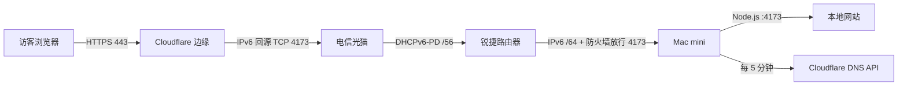

# 从零把 Mac mini 网站通过 IPv6 发布到公网

> 以“中国电信光猫 + 锐捷路由器 + Mac mini + Cloudflare”为例，保留双路由，不使用内网穿透。

这篇教程记录一次真实的家庭建站过程：让本地 Node.js 网站获得公网 IPv6，通过域名访问，动态地址变化后自动更新 DNS，并在 Mac 登录后自动启动。文中的域名、地址、账户和 Token 都是占位符；不要把自己的密码、API Token、宽带账号或家庭地址提交到 Git。

## 最终架构



关键点：

- IPv6 不依赖 NAT 端口映射，每台设备可以拥有公网地址；真正控制入站访问的是路由器 IPv6 防火墙。
- 光猫有公网 IPv6，不代表下游设备一定能获得地址；还需要前缀委派（DHCPv6-PD）和 LAN 侧路由通告（RA）。
- 动态 DNS 只负责更新域名，不会自动修改路由器里绑定旧 IPv6 的防火墙规则。
- Cloudflare 代理不是内网穿透：Cloudflare 仍通过公网 IPv6 主动连接家庭源站。

## 0. 准备工作

需要：

- 已能在 Mac 本机打开的网站，例如 `http://localhost:4173`。
- 支持 IPv6 的家庭宽带、光猫和路由器。
- 一个自己的域名。
- Cloudflare 免费账户。
- macOS、Node.js 22.5 或更高版本。

先记录当前配置，并备份光猫和路由器设置。不要为了 IPv6 直接恢复出厂、关闭整个防火墙或开放整个 LAN 前缀。

## 1. 判断电信是否已经提供公网 IPv6

登录光猫管理页，查看上网业务的 WAN IPv6。下面几类地址含义不同：

| 地址形式 | 含义 | 能否用于公网网站 |
| --- | --- | --- |
| `fe80::/10` | 链路本地地址 | 不能 |
| `fc00::/7` 或 `fd00::/8` | ULA 内部地址 | 不能直接公网访问 |
| `2000::/3` | 全球单播地址 | 通常可以 |

如果 WAN 页面同时显示类似 `/56` 的“委派前缀”，说明运营商不只给光猫一个地址，还允许光猫把多个 `/64` 子网交给下游路由器。这正是保留双路由时最重要的条件。

注意：页面显示 `地址/64` 时，`/64` 是子网长度，不是地址的一部分。

## 2. 保留双路由并把 IPv6 传到锐捷

本次方案不需要把光猫改桥接，也不需要把锐捷改 AP。网络结构保持：

```text
电信光猫（路由模式） → 锐捷（路由模式） → Mac mini
```

### 光猫侧

不同固件名称略有差异，目标是：

1. 上网业务启用 IPv6，获取方式为 DHCPv6 或自动。
2. 启用 DHCPv6-PD / Prefix Delegation，把运营商下发的前缀继续委派给下游。
3. LAN 侧允许 IPv6 路由通告。
4. 保持 NAT66 关闭。原生 IPv6 不需要再套一层地址转换。

如果普通管理员页面没有前缀委派选项，应联系电信装维或客服确认，不要从非官方教程下载未知程序或尝试绕过设备权限。

### 锐捷侧

在“IPv6 设置”中：

1. WAN 联网类型选择“动态 IP / 宽带上网”或 DHCPv6。
2. DHCPv6 客户端同时请求 IPv6 地址和前缀（IA_NA + IA_PD）。
3. LAN 启用 IPv6、RA/SLAAC 和 DHCPv6。
4. 保存后检查锐捷是否获得全球 IPv6，以及 LAN 是否拿到 `/64` 子网。

只看到锐捷 WAN IPv6、看不到“IPv6 前缀”，通常表示光猫没有把 PD 继续下发。此时 Mac 往往只能获得 `fe80::`，网站也无法从公网访问。

## 3. 确认 Mac mini 获得公网 IPv6

先找出实际联网接口：

```bash
networksetup -listallhardwareports
route -n get default | grep interface
```

常见情况：

- Wi-Fi 通常是 `en1`。
- 内置以太网通常是 `en0`。
- 不要照抄接口名，以当前 Mac 输出为准。

假设接口是 `en1`：

```bash
ifconfig en1 | grep inet6
```

可能同时看到：

- `fe80::...`：链路本地地址，忽略。
- 带 `temporary`：隐私临时地址，会主动轮换，不适合 DNS。
- 带 `dynamic` 或无 `temporary`：优先作为服务地址。

本文后续用文档保留地址 `2001:db8:1234:5678::1000` 代表 Mac 的实际公网 IPv6。

如果路由器支持静态 DHCPv6 分配，可以为 Mac 固定地址后缀，例如 `::1000`。运营商前缀变化时，前半部分仍可能变化，所以还需要 DDNS。

## 4. 让网站监听 IPv6

Node/Express 服务应监听所有接口，而不是只监听 `127.0.0.1`。例如：

```js
const port = Number(process.env.PORT || 4173);
app.listen(port, "::", () => {
  console.log(`Listening on ${port}`);
});
```

有些 macOS/Node.js 组合在省略 host 时也会监听 IPv6，但必须实际检查：

```bash
lsof -nP -iTCP:4173 -sTCP:LISTEN
```

看到 `TCP *:4173 (LISTEN)` 且类型为 IPv6 后，再测试：

```bash
curl -g -6 -I 'http://[2001:db8:1234:5678::1000]:4173/'
```

预期返回 `200`。IPv6 URL 中的地址必须放在方括号里。

## 5. 只开放网站所需的入站端口

在锐捷的 IPv6 防火墙/访问控制页面添加规则：

```text
方向：WAN → LAN
协议：TCP
目标设备：Mac mini
目标 IPv6：Mac 的稳定服务地址
目标端口：4173
动作：允许
```

不要：

- 关闭整个 IPv6 防火墙。
- 把整个 `/64` 设置为允许入站。
- 开放 SSH、文件共享或远程桌面等无关端口。

IPv6 一般不做端口转发；如果路由器页面只有“IPv4 端口映射”，那不是这里需要的功能。

如果运营商前缀变化，DDNS 虽然会更新域名，但“完整目标 IPv6”防火墙规则可能仍指向旧地址。优先选择能按设备/MAC 或固定地址后缀匹配的规则；如果路由器做不到，需要在前缀变化后同步更新规则。

## 6. 用 launchd 让网站自动启动

图形登录后的个人服务适合使用 LaunchAgent。先建立只含 ASCII 的包装脚本路径，避免部分 launchd 环境对中文项目路径处理异常。

`/Users/你的用户名/Library/Application Support/MyGameVault/run-server.zsh`：

```zsh
#!/bin/zsh
set -euo pipefail

cd '/Users/你的用户名/Documents/my-game-vault'
exec /opt/homebrew/bin/node server.mjs
```

赋予执行权限：

```bash
chmod 700 '/Users/你的用户名/Library/Application Support/MyGameVault/run-server.zsh'
mkdir -p '/Users/你的用户名/Library/Logs/MyGameVault'
```

创建 `~/Library/LaunchAgents/com.example.my-game-vault.plist`：

```xml
<?xml version="1.0" encoding="UTF-8"?>
<!DOCTYPE plist PUBLIC "-//Apple//DTD PLIST 1.0//EN" "http://www.apple.com/DTDs/PropertyList-1.0.dtd">
<plist version="1.0">
<dict>
  <key>Label</key>
  <string>com.example.my-game-vault</string>
  <key>ProgramArguments</key>
  <array>
    <string>/bin/zsh</string>
    <string>/Users/你的用户名/Library/Application Support/MyGameVault/run-server.zsh</string>
  </array>
  <key>EnvironmentVariables</key>
  <dict>
    <key>PATH</key>
    <string>/opt/homebrew/bin:/usr/local/bin:/usr/bin:/bin</string>
    <key>PORT</key>
    <string>4173</string>
  </dict>
  <key>RunAtLoad</key>
  <true/>
  <key>KeepAlive</key>
  <true/>
  <key>StandardOutPath</key>
  <string>/Users/你的用户名/Library/Logs/MyGameVault/server.log</string>
  <key>StandardErrorPath</key>
  <string>/Users/你的用户名/Library/Logs/MyGameVault/server-error.log</string>
</dict>
</plist>
```

检查并载入：

```bash
plutil -lint ~/Library/LaunchAgents/com.example.my-game-vault.plist
launchctl bootstrap "gui/$(id -u)" ~/Library/LaunchAgents/com.example.my-game-vault.plist
launchctl print "gui/$(id -u)/com.example.my-game-vault"
```

测试 KeepAlive 时，可以结束 Node 进程，再确认 launchd 是否生成了新 PID。不要通过重启整台家庭路由器来验证应用自启。

## 7. 把域名接入 Cloudflare

域名可以在任意注册商购买，然后把注册商处的权威 DNS 服务器改成 Cloudflare 分配的两条 nameserver。

等待注册局同步后检查：

```bash
dig +short NS example.com
```

新域名、nameserver 修改和本地 DNS 负缓存都可能造成延迟。权威 DNS 已正确但家中打不开时，可以分别查询公共递归 DNS：

```bash
dig +short @223.5.5.5 A example.com
dig +short @119.29.29.29 A example.com
```

### 建议的两条 AAAA 记录

| 名称 | 类型 | 内容 | Cloudflare 代理 | 用途 |
| --- | --- | --- | --- | --- |
| `@` | AAAA | Mac 当前公网 IPv6 | 开启 | 用户直接访问 `example.com` |
| `direct` | AAAA | Mac 当前公网 IPv6 | 关闭 | 排障时直连 `direct.example.com:4173` |

关闭代理的记录会公开家庭 IPv6；如果不需要直连排障，可以不创建。

## 8. 让根域名无需端口即可访问

浏览器直接输入域名时使用 HTTP 80 或 HTTPS 443，而网站实际监听 4173。Cloudflare 免费版的 Origin Rules 支持改写源站目标端口：

1. 打开 **Rules → Origin Rules**。
2. 创建规则，例如 `Root domain to Mac port 4173`。
3. 匹配根域名，或在该 Zone 只有一个代理记录时匹配全部请求。
4. 将 **Destination Port** 改写为 `4173`。
5. 部署规则。

如果源站 4173 只提供 HTTP：

1. 在 **SSL/TLS → Overview → Configure** 选择 **Flexible**。
2. 在 **Edge Certificates** 开启 **Always Use HTTPS**。

这样访客到 Cloudflare 使用 HTTPS，Cloudflare 到家庭源站仍是 HTTP。它部署最简单，但不是端到端加密。更严格的长期方案是让 Caddy/Nginx 在源站提供证书，再把 Cloudflare 改为 **Full (Strict)**。

Cloudflare 默认不代理任意端口；4173 需要 Origin Rule，或改用其支持的端口。参见文末官方资料。

## 9. 创建最小权限 DDNS Token

在 Cloudflare **My Profile → API Tokens** 创建 Token：

```text
权限：Zone / DNS / Edit
资源：只包含 example.com
```

不要使用 Global API Key，也不要把 Token 写入仓库。将 Token 保存进 macOS 钥匙串：

```bash
read -s CF_TOKEN
security add-generic-password -U \
  -a 'example.com' \
  -s 'com.example.cloudflare-ddns' \
  -w "$CF_TOKEN"
unset CF_TOKEN
```

DDNS 程序每次执行应完成：

1. 从指定接口读取全球 IPv6，排除 `fe80::` 和 `temporary`。
2. 优先选择固定后缀的 DHCPv6 地址。
3. 从钥匙串读取 Token。
4. 查询 Cloudflare Zone 中的 AAAA 记录。
5. 地址变化时调用 API 更新；未变化时退出。

核心 API：

```text
GET  /client/v4/zones/{zone_id}/dns_records?type=AAAA&name=example.com
PUT  /client/v4/zones/{zone_id}/dns_records/{record_id}
```

更新根域名时保留 `proxied: true`，更新直连子域名时使用 `proxied: false`。日志中只记录域名和 IPv6，不输出 Token。

## 10. 每 5 分钟运行 DDNS

创建第二个 LaunchAgent，核心设置如下：

```xml
<key>RunAtLoad</key>
<true/>
<key>StartInterval</key>
<integer>300</integer>
```

DDNS 是运行后立即退出的短任务，所以不需要 `KeepAlive`。载入后检查：

```bash
launchctl print "gui/$(id -u)/com.example.cloudflare-ddns"
tail -n 20 ~/Library/Logs/MyGameVault/ddns.log
```

预期看到 `run interval = 300 seconds`、`last exit code = 0`。

## 11. 完整验证清单

按从内到外的顺序排查：

```bash
# 本机应用
curl -I http://127.0.0.1:4173/

# 本机公网 IPv6
curl -g -6 -I 'http://[2001:db8:1234:5678::1000]:4173/'

# Cloudflare 权威 DNS
dig +short @你的-cloudflare-ns AAAA example.com

# 公共递归 DNS
dig +short @223.5.5.5 A example.com
dig +short @223.5.5.5 AAAA example.com

# 最终 HTTPS
curl -I https://example.com/
```

最终应满足：

- HTTP 自动 `301` 跳转 HTTPS。
- HTTPS 返回 `200`。
- `server: cloudflare`。
- 网站进程由 launchd 保持运行。
- DDNS 最近退出码为 0。

## 12. 常见故障

### 光猫有 IPv6，Mac 只有 `fe80::`

下游没有得到前缀。检查光猫 DHCPv6-PD、锐捷 IA_PD、LAN RA/SLAAC，而不是反复切换 DNS。

### `ifconfig en0` 没输出

接口可能是 `en1` 或 USB 网卡。用 `route -n get default` 找真实默认接口。

### 手机打不开，但电脑本机能打开

- AAAA-only 直连要求手机所在网络也支持 IPv6。
- Cloudflare 代理后的根域名同时提供边缘 IPv4/IPv6，兼容性更好。
- 新域名可能被家中路由器缓存为“不存在”；用手机流量和公共 DNS 交叉测试。

### DDNS 已更新，网站仍离线

运营商前缀变化后，路由器的精确 IPv6 防火墙规则可能仍绑定旧地址。DDNS 不会替你更新这条规则。

### Mac 重启后网站没有启动

检查 LaunchAgent 日志、绝对路径、Node 路径和文件权限。包含中文的项目路径可以放在 ASCII 包装脚本后面执行。

### Mac 休眠后网站消失

LaunchAgent 只能保持进程，不能让休眠的 Mac 对外服务。家庭服务器需要保持唤醒、有线联网，并关闭会中断网络服务的深度睡眠策略。

### 网页正常，视频很卡

家庭上行必须显著高于视频码率。4K 60fps 原画可能需要 30–90 Mbps；建议生成 1080p H.264/AAC、8–15 Mbps、`faststart` 的移动版，或把大视频放到 S3 兼容对象存储。Cloudflare 免费/Pro/Business 的单文件缓存上限为 512 MB，超大原画不能依赖边缘缓存解决。

## 13. 安全与合规

- 公网只开放网站端口，管理接口必须认证并限制写操作。
- Token 使用最小权限并存入钥匙串；一旦泄露立即撤销。
- 不在截图、README、Issue 或提交记录中公开光猫密码、宽带账号、家庭地址、Token 和真实源站 IPv6。
- 域名实名认证与网站备案是两件事。注册局出现 `serverHold` / `clientHold` 时 DNS 会停止；是否需要备案应根据服务器位置、接入方式和当地最新要求向注册商或运营商确认。
- 家庭宽带条款可能限制长期对外服务或高流量上传；正式、高可用服务应使用合规的云服务器或托管方案。

## 14. 本次实践的排错顺序

实际搭建时，最省时间的顺序是：

1. 先确认光猫有全球 IPv6 和可委派前缀。
2. 保留双路由，修通 DHCPv6-PD 和 LAN RA。
3. 确认 Mac 拿到非临时全球地址。
4. 本机验证 Node 监听 IPv6。
5. 只开放 TCP 4173。
6. 配置 launchd，先保证服务不会因终端关闭而消失。
7. 接入 Cloudflare，创建 AAAA 和最小权限 Token。
8. 配置 DDNS，再处理根域名、HTTPS 和端口改写。
9. 最后用权威 DNS、公共 DNS、手机流量分别验证。

不要一开始同时修改桥接、AP、DNS、防火墙和应用端口；一次只改变一层，才能准确定位故障。

## 官方资料

- [Cloudflare：Origin Rules](https://developers.cloudflare.com/rules/origin-rules/)
- [Cloudflare：支持代理的网络端口](https://developers.cloudflare.com/fundamentals/reference/network-ports/)
- [Cloudflare：API Token 创建与验证](https://developers.cloudflare.com/fundamentals/api/get-started/create-token/)
- [Cloudflare：SSL/TLS 加密模式](https://developers.cloudflare.com/ssl/origin-configuration/ssl-modes/)
- [Cloudflare：Always Use HTTPS](https://developers.cloudflare.com/ssl/edge-certificates/additional-options/always-use-https/)
- [Cloudflare：默认缓存行为与 512 MB 限制](https://developers.cloudflare.com/cache/concepts/default-cache-behavior/)
- [阿里云：新注册域名与实名认证状态](https://help.aliyun.com/zh/dws/getting-started/quickly-register-a-new-domain-name)
- [阿里云：域名解析不生效排查](https://help.aliyun.com/zh/dns/pubz-parse-does-not-take-effect-unable-to-access-website-faq)
